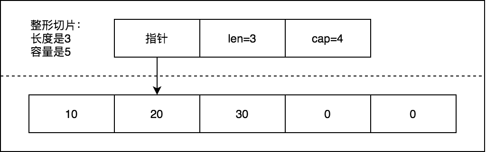
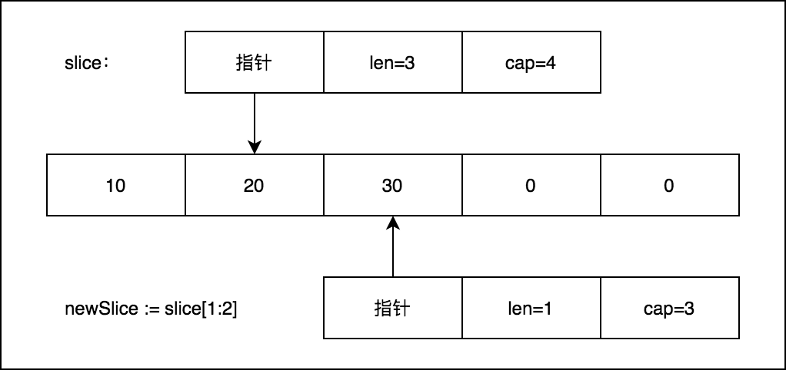
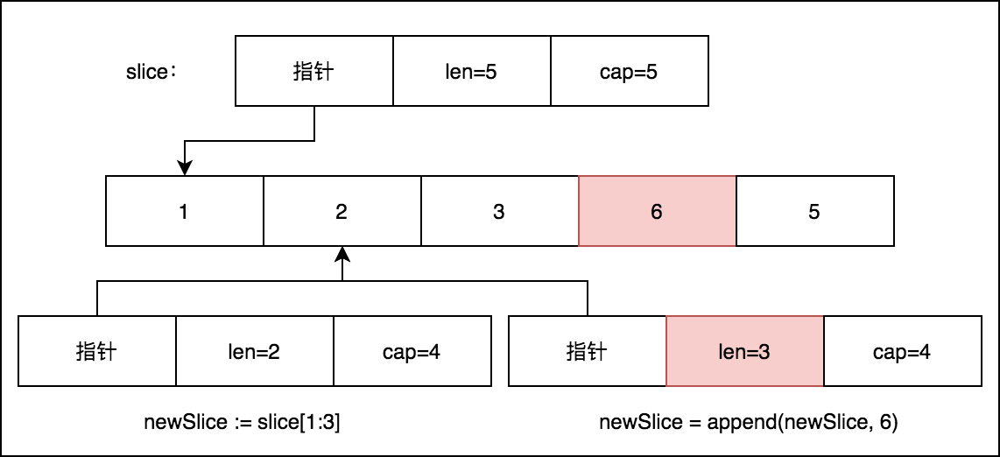
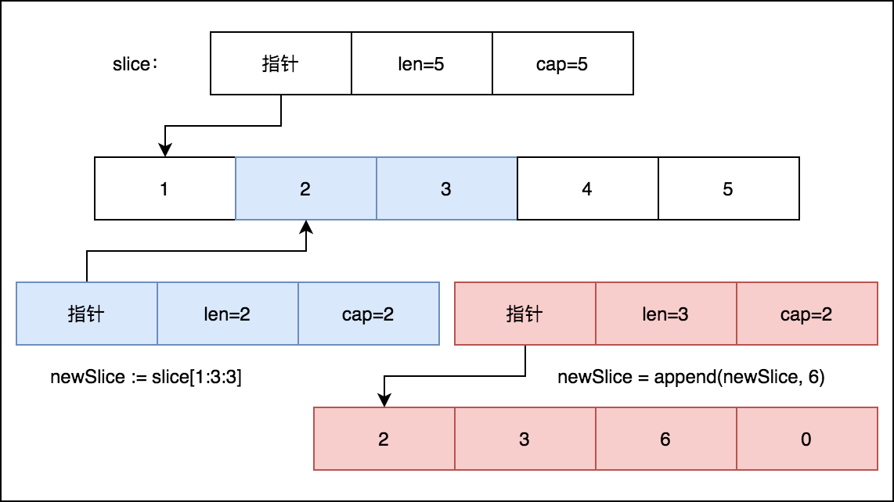

## 切片和数组的不同

数组是固定长度序列，而切片是 **可变长度** 序列。

所以数组和切片最大的不同，就是声明方式的不同。

```go
arr := [3]int{1,2,3}

slice := []int{1,2,3}
```

切片因为是可变长度，所以可以不指定长度。


数组和切片还有一个不同是：

切片不能使用 `==` 进行比较，而数组可以。数组只要满足“长度相同、数组元素类型相同”就认为是相等的。

而切片的长度是可变的，意味着底层数组元素改变，那么切片就会改变，就会出现同一切片在不同时间拥有不同的的元素，这就乱套了。


## 切片的组成

切片和数组是紧密相连的。

切片可以看做是对数组的抽象，它的对象引用的是底层的数组。

因此，为了更好地描述数组，切片定义了三个属性：

- 指针：指向底层数组中第一个可以从切片访问的元素。
- 长度：切片中元素的个数，用 Go 内置的 `len()` 函数可以求出
- 容量：切片中最大可增长的元素个数（从切片的起始元素到底层数组的最后一个元素间的元素个数，用 `cap()` 函数可以求出）




如图，一个切片指向底层数据 20 的位置，长度是 3，容量是 4。


## 切片的声明和初始化

切片的声明不指定长度：

```go
var slice []int 		// 声明一个 int 型切片
var slice []string 	// 声明一个 string 型切片
```


可以使用 Go 语言内置的 make 函数来创建并初始化切片：

```go
slice := make([]int, len, cap)
```

传入 len 和 cap 参数来指定切片的长度和容量，cap 可以不指定，表示长度和容量相等。

make 创建的切片里的元素，默认初始化为对应类型的零值。

```go
slice := make([]string, 5) // 创建长度和容量都为5个元素的字符串切片，初始化为""
slice := make([]int, 2, 5) // 创建长度为2，容量为5的的整形切片，初始化为0
```


也可以使用切片字面量进行初始化：

```go
slice := []int{1,2,3,4}
```


通过索引的方式初始化：

```go
slice := []string{99: "hello"}
```

索引 99 表示这会创建长度和容量都是 100 个元素的切片。


## nil 切片和空切片

声明一个切片什么都不处理，就是 nil 切片：

```go
var slice []int // nil整形切片
```

nil 在描述一个切片不存在的时候会非常好用。

```go
if slice == nil {
  //todo
}
```


而空切片是初始化为对应类型的零值的切片，可以使用 make 来创建：

```go
slice := make([]int, 0)
```

或者使用字面量：

```go
slice := []int{}
```


## 切片的使用

下标引用切片元素：

```go
s1 := []int{1,2,3,4,5}
fmt.Println(s1[3]) // 4
```


范围引用切片形式： **[下限:长度上限:容量上限]**

```go
fmt.Println(s1[2:4]) // [3,4], 从下标2到下标3
fmt.Println(s1[:5])  // [1,2,3,4]，从开始到下标4，下标5不包括在内
fmt.Println(s1[2:])  // [3,4,5]，从下标2开始到最后
fmt.Println(s1[2:3:4]) // [3] 长度为1，容量为2
```


切片的这种引用方式，其实是创建了一个新的切片，新切片和原切片共享同一个底层数组。




新切片的长度上限不能超过容量上限。

对于新切片 `newslice[i:j:k]` 的长度和容量可以计算为：

- 长度：j - i
- 容量：k - i


修改新切片的值，也会反映到原切片上：

```go
s := []int{0: 10, 1: 20, 3: 30}
slice := s[1:]
newSlice := slice[1:2]
newSlice[0] = 40
fmt.Println(slice[1]) // 40
```


## 切片增长

Go 语言内置的函数 append 会从切片的末尾追加元素，从而实现切片的增长。

它的实现原理是：

当增加的元素超过底层数组的容量时，它会创建一个新的底层数组，容量是原来的 2 倍，然后将原数组的元素全部复制到新数组里，最后再追加新的值。

> 事实上，append 还更加智能，当切片的容量小于 1000 个元素时，会成倍增加容量，一旦元素超过 1000，容量的增长因子就为 1.25，也就是每次增加 25% 的容量。


当 append 没有超过切片容量时，直接追加：

```go
slice := []int{1,2,3,4,5}
newSlice := slice[1:3] // [2,3]
newSlice = append(newSlice, 6) // [2,3,6]
```




可以看到，追加之后，原底层数组的相应值也被修改。这样是 **不太安全** 的做法，更好的做法是，使用 **容量上限** 的索引，来限制新切片的容量和长度相等，这样在 append 之后，就会创建新的底层数组进行修改，不影响原底层数组，如：

```go
slice := []int{1,2,3,4,5}
newSlice := slice[1:3:3] // [2,3]
newSlice = append(newSlice, 6) // [2,3,6]
```




可以看到，当 append 超过切片容量时，会基于原切片创建一个新的底层数组，容量为原切片容量的 2 倍，然后将原切片的元素复制到新切片，并追加新的元素。


除了追加单个元素，append 支持可变参数，还可以一次追加多个值，使用 `...` 运算符即可，比如将一个切片追加到另一个切片：

```go
s1 := []int{1,2}
s2 := []int{3,4}
s1 = append(s1, s2...)
fmt.Println(s1) // [1,2,3,4]
```


切片有增长，就有删除，切片的删除用 `[i:j]` 的方式就可以做到：

```go
slice := []int{1,2,3}
slice = slice[:len(slice) - 1] // 删除末尾的元素
slice = slice[1:] // 删除第 1 个元素
```

如果要删除中间某个元素，可以借助 append 来完成：

```go
slice = append(slice[:1], slice[2:]...) // 删除第2个元素
```


## 切片的迭代

所谓迭代，就是遍历切片并输出切片的元素。

和大多数语言一样，可以通过 for 循环来迭代切片：

```go
for i := 0; i < len(slice); i++ {
  fmt.Println(slice[i])
}
```


Go 语言提供了更简便的迭代方式是使用一个内置的关键字 range，也需要配合 for 来使用：

```go
for index, value := range slice {
  fmt.Println(index, value)
}
```

可以看到，range 会返回两个值，一个是索引，一个是元素的值，如果不需要显示索引，可以用 `_`（下划线）忽略掉：

```go
for _, value := range slice {
  fmt.Println(value)
}
```


需要注意的是，range 返回的元素是对应位置元素的副本，如果想通过返回值的地址找到原数组元素的值，将会出错，如下：

```go
slice := []int{1,2,3}
for index, value := range slice {
  fmt.Printf("value addr:%X, slice[%d] addr: %X\n", &value, index, &slice[index])
}

// 输出
value addr:C000016050, slice[0] addr: C000014080
value addr:C000016050, slice[1] addr: C000014088
value addr:C000016050, slice[2] addr: C000014090
```

可以看到，迭代返回的 value 的地址总是相同的（这是因为迭代过程中返回的 value 是依次赋值的）。而原数组元素的地址总是不一样的。


## 在函数间传递切片

在讲【数组】一文中，我们对比传数组和传指针的性能，当时也说到最好的方式是传切片。

传切片只会传切片本身，而不会涉及到底层数组。

这样一来，性能的消耗就只来源于切片本身的大小。

在 64 位架构的系统上，一个切片只占 24 字节的内存：指针自动占 8 字节，len 和 cap 分别也占 8 字节。

在函数间传 24 字节的数据是非常快速和高效的，也不会有指针那样的操作复杂和安全的问题。


## 多维切片

和数组一样，切片也有多维切片，也就是切片的切片。

比如创建一个整形切片：

```go
slice := [][]int{{10}, {10,20}}
```


其中，每一维切片也支持切片的所有操作，在此就不多说了。

（多维切片唯一值得注意的就是写的时候一定要睁大眼睛看好，不要串起来了，最好在纸上画出来）


## 总结

切片和数组的不同

切片的创建和使用

切片的增长原理

切片的迭代

切片这种特性，很容易实现栈和队列的数据结构，大家可以思考一下。

