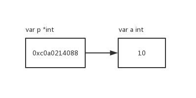

Go 语言中有指针的概念，但用法比 C/C++ 中的要简洁很多。

## 01 指针是什么

变量存储值，指针存储变量的地址。




## 02 指针的类型

我们通过 `var x *int` 声明一个指针变量，指针的类型就是整形指针(*int)，所以，指针的类型由指针所指向的变量的类型决定。

类似的还有：

`var x *float64` ：浮点型指针

`var x *string` ：字符串型指针

我们也可以声明变量 `var x int`，通过 `&x` (取地址符) 来获得一个指向整形变量的指针。


## 03 指针可以比较，但不能运算

指针类型的零值是 `nil`，两个指针可以通过比较是否指向同一个变量或者是否都为 `nil` 来判断是否相等。

```go
var x, y int
fmt.Println(&x == &x, &x == &y, &x == nil) // "true  false false"
```


Go 语言中的指针不能参与运算，比如下面这段代码：

```go
func incr(x *int) int {
	*x++
	return *x
}

func main() {
  	x, y := 1, 2
  	p, q := &x, &y
  	p++ // error
  	fmt.Println(p + q) // error
  
  	incr(&x) // x = 2
  	fmt.Println(x) // 2
  	fmt.Println(incr(&x)) // x = 3
}
```

p, q 是指针，不能做形如 `p++`，`p+q` 之类的操作。而 `*x++`，其实是 x 指向的值进行运算，是没问题的。


## 03 指针的解引用

指针的解引用就是获取指针所指向的值。通过 `*p`(取值符) 获取指针 `p` 指向的值。

下面一个程序，通过指针的解引用，交换两个数。

```go
package main

import "fmt"

func swap(p, q *int) {
	t := *p
    *p = *q
    *q = t
}

// 更简单的swap
//func swap(p, q *int) {
//    *p, *q = *q, *p
//}

func main() {
    p, q := 2, 5
    swap(&p, &q)
    fmt.Println(p, q)
}
```

可以看到，`*p` 可以作为左值，也可以作为右值，作为左值时，表示对指针所指向变量重新赋值，作为右值时，表示取指针所指向变量的值。

## 04 new 函数

Go 语言还提供了另外一种类型来创建指针变量，就是使用内置的 `new` 函数。表达式 `new(T)` 创建一个未命名的 T 类型变量，初始化为 T 类型的零值，并返回其地址。


```go
p := new(int) // 创建一个 *int 类型的指针 p
fmt.Println(*p) // 输出 0
*p = 2 // 重新设置 p 所指向变量为 2
fmt.Println(*p) // 输出 2
```

每一次调用 `new` 都会返回不同变量地址，比如：

```go
p := new(int)
q := new(int)
fmt.Println(p == q) // false
```

输出的结果中，p 和 q 分别指向不同的地址。


值得注意的是，`new` 是 Go 语言内置的一个函数，并不是一个关键字，所以，我们可以用它来命名变量，比如：

```go
func diff(old, new int) int { 
    return new - old 
}
```

但不推荐这样做，这会让程序的可读性变差。

## 05 总结

Go 语言的指针很简单，比 C/C++ 中的要简洁。

指针可以比较，但不能参与运算，`new()` 可以创建一个指针变量。