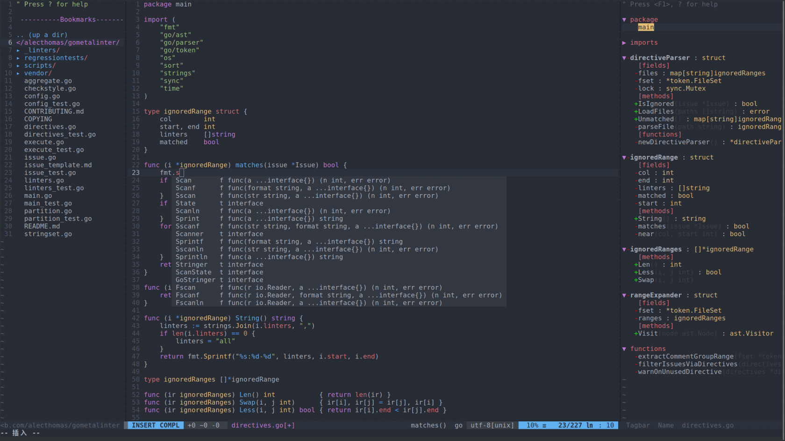
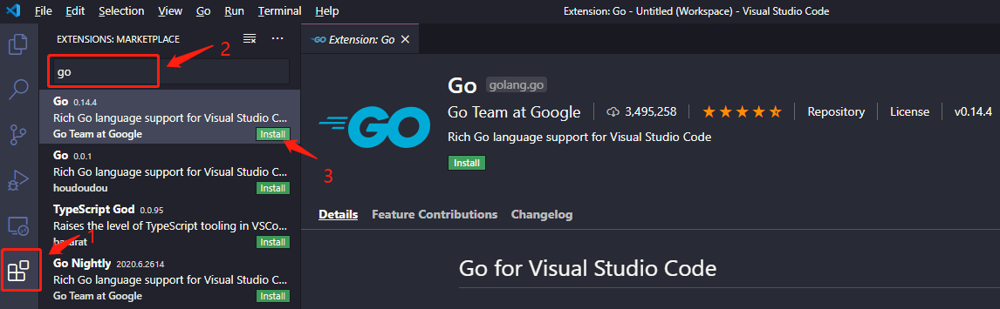
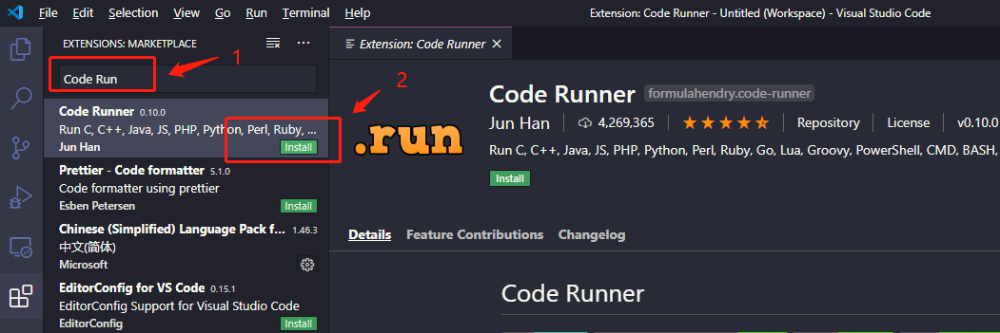
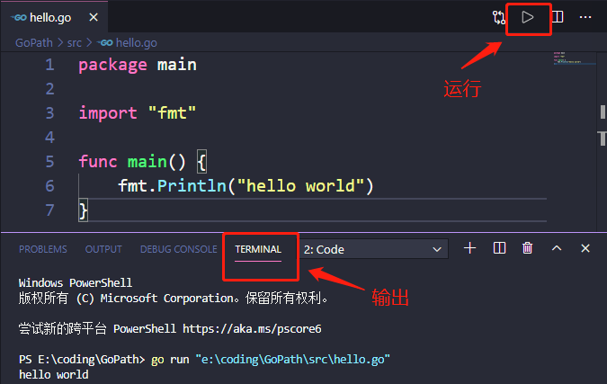
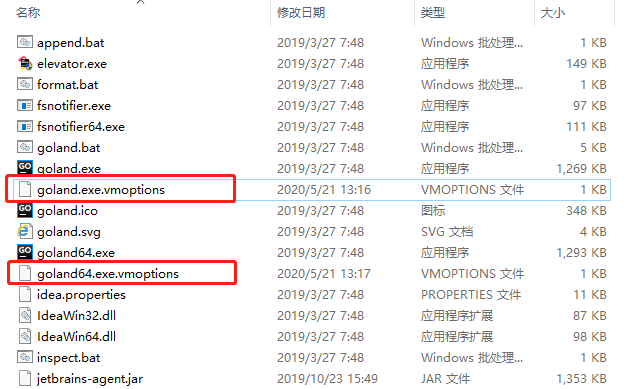

工欲善其事，必先利其器。

开发 Go 语言，一款良好的编辑器 + IDE 是必不可少的。

根据前人的总结和分享，有以下几款工具崭露头角。

## 01 Vim 党

在 Vim 党眼中，一切 IDE 都显得格外的蹩脚。

他们崇尚的理念是：携 Vim 走天下，挥一挥衣袖，不带走一片云彩。

结合 [Vim-go](https://github.com/fatih/vim-go) 插件，Vim 便能打造出炫酷的 Go 开发环境。

我们可以参考这个 [vimrc](https://github.com/ctimbai/vimfile/blob/master/govim/.vimrc) 文件进行配置。

配置过程比较简单，就是安装 Vim 插件的那一套方法，如果你喜欢折腾，可以自己倒腾倒腾，如果你想快速上手，可以参考[这里](https://github.com/ctimbai/vimfile/tree/master/govim)的快速配置。

最终配置好的效果图如下图：




详细请参见：

https://reading.developerlearning.cn/other/dev-tools-vimrc/

https://learnku.com/articles/24924

https://segmentfault.com/a/1190000017270664


## 02 文本编辑器 + 插件

首推：[Sublime Text3](https://www.sublimetext.com/3)、[VSCode](https://code.visualstudio.com/) 和 [Atom](https://atom.io/)。

它们都可以安装相应的 Go 插件来支持 Go 语言的编码。比如：Sublime + GoSublime，VSCode + go-extension，Atom + go-plus。

个人比较钟爱 VSCode，因为平时还要写 C/C++ 程序，用 VSCode 只要安装相应的插件就可以搞定这一切。

下面就以 VSCode 为例，简单说下配置方法。

我们假设在 Windows 上，你已经安装好了 Go 程序，并设置好相关的环境变量，比如 `GOROOT` 、`GOPATH` 以及 `PATH`。

接下来下载 [VSCode](https://code.visualstudio.com/) 并安装。

然后安装 VSCode 的 Go 插件：在 VSCode 界面中点击扩展按钮，搜索 go，出现的第一个 Go 插件，直接点击安装即可。



还有一个插件：Code Runner，它可以让你的 VSCode 能够编译运行 Go 程序，我们也一并安装。



此外，如果想更顺畅的编写 Go 程序，还需要安装以下工具：

```sh
gocode
gopkgs
go-outline
go-symbols
guru
gorename
dlv
gocode-gomod
godef
godef-gomod
goreturns
golint
gotests
gomodifytags
impl
fillstruct
goplay
```

这些工具有些来自 Google 的服务器 `golang.org`，如果无法用梯子，可以从其在 GitHub 上对应的[镜像仓库](https://github.com/golang)下载：

```sh
# 首先创建相应的目录
mkdir -p $GOPATH/src/golang.org/x

# 然后 git clone 下面几个包
git clone https://github.com/golang/tools.git $GOPATH/src/golang.org/x/tools
git clone https://github.com/golang/net.git $GOPATH/src/golang.org/x/net
git clone https://github.com/golang/lint.git $GOPATH/src/golang.org/x/lint

# 在 go install 安装
go install golang.org/x/tools/...
```

接下来随便创建一个 Go 程序文件，在界面右下角会提示要你安装一些工具，点击 `Install All`，即可安装上述的工具了。

如果还是有些工具包无法安装，同样通过 GitHub 上下载相关的镜像包进行手动安装即可。

以上一切都安装好了，就可以用 VSCode 编写并运行 Go 程序了。




vscod：https://juejin.im/post/5c52fb62518825233b4ea6bf

https://mp.weixin.qq.com/s/y1iZWX0ce9bQB9_iq5y1aQ

## 03 IDE

首推：[Goland](https://www.jetbrains.com/go/)、[LiteIDE](http://liteide.org/cn/)。

这是专门针对 Go 打造的专业级 IDE，功能丰富，整体上自然要强于上面说的插件式 IDE。

我个人比较钟爱 Goland（这也是广大开发者比较中意的 JetBrains 全家桶中的一员）。

下面就以 Goland 为例，简单说下配置方法。

Goland 是收费软件，但我们也可以用点小手段来免费使用：[这里](http://c.biancheng.net/uploads/course/go/Goland_Crack_Sinicization.zip)下载相关的破解补丁。

该补丁包含三个文件：

- jetbrains-agent.jar：破解补丁
- resources_cn.jar：汉化补丁
- 激活码.txt：激活码

将 jetbrains-agent.jar 和 resources_cn.jar 拷贝到你的 Goland 安装目录的bin文件夹下，比如：`D:\Program Files\JetBrains\GoLand 2019.1\bin`

然后打开下面两个文件：



并在文件最后一行添加如下一行（需要根据自己的路径修改对应的值）：

```sh
-javaagent:D:\Program Files\JetBrains\GoLand 2019.1\bin\jetbrains-agent.jar
```

接着回到 Goland 界面，点击“帮助”->“注册”->“激活码”，复制“激活码.txt” 中的激活码填入，之后便可免费使用 Goland 了。

在开始编写 Go 代码之前，还需要简单配置下 Goland，主要是 `GOROOT`、`GOPATH` 环境变量的配置。

配置路径是在：主菜单 `Files->Settings->Go->GOROOT/GOPATH` 

对于 `GOROOT`，如果本地安装了多个版本的 Go，可以在右侧下拉选择相应的版本。

对于 `GOPATH`：可以配置多个全局的 `GOPATH`，IDE 会自动识别环境变量中的 `GOPATH`。

然后，便可以愉快地编写 Go 代码了。

通过主菜单 `File->New->Project` 新建一个 Go 项目（这里就会用到上面配置的 `GOROOT` 和 `GOPATH`），然后在项目的基础上新建 `.go` 文件，就可以开始 coding 了，coding 完之后点击菜单栏 `Run->Run` 或者 `Ctrl+F5` 来运行代码。

## 04 总结

三款比较流行的 Go 编辑器的配置上手体验：Vim、VSCode、Goland。

除了以上介绍，还有很多可用的编辑器和 IDE，详见官方：[Go 编辑器+IDE大杂烩](https://github.com/golang/go/wiki/IDEsAndTextEditorPlugins)


---

参考：

[1] https://github.com/fatih/vim-go

[2] https://www.sublimetext.com/3

[3] https://code.visualstudio.com/

[4] https://atom.io/

