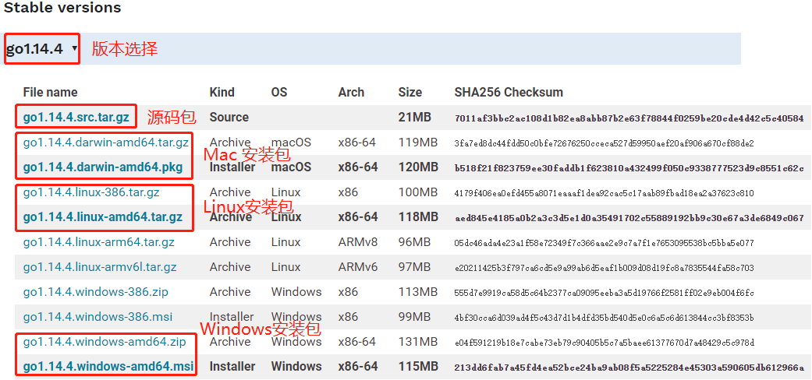
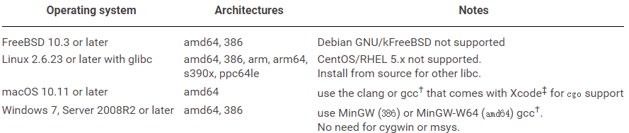

下载，安装，验证。

## 01 下载

进入 [golang 官网](https://golang.org/dl/)[1]，如果打不开，可以用这个 [golang 中国](https://golang.google.cn/dl/)[2]。

Go 语言支持多种常用系统，比如：Windows、Linux、Mac OS 等，可以下载各个系统对应的安装包进行安装：



本教程使用最新稳定版 `go1.14.4` 版本。

## 02 安装

Go 语言提供了三种常见的安装方式：源码安装、二进制包安装、软件包安装程序安装，和第三方工具安装。

安装之前，先确保自己的系统满足下面的[要求](https://golang.org/doc/install)：



### 2.1 源码安装

我们以 Unix 风格的系统为例，首先下载 Go 的源码包，以 `go1.14.4.src.tar.gz` 为例：

```sh
wget https://dl.google.com/go/go1.14.4.src.tar.gz
```

在当前目录解压：

```sh
tar -xf go1.14.4.src.tar.gz
```

然后进入 `./go/src` 执行：

```sh
cd go/src
./all.bash
```

进行编译，编译完成后，如果成功安装 Go，会看到如下输出：

```sh
ALL TESTS PASSED
---
Installed Go for linux/amd64 in /root/go
Installed commands in /root/go/bin
*** You need to add /root/go/bin to your PATH.
```

> **注意：** Go 1.4及其之前版本使用 C 编译器，比如 gcc 进行编译，因此上面的过程是没问题的。但是 1.5 及之后的版本实现了  bootstrapping（自举编译），也就是完全使用 Go 语言编写的编译器和运行时进行编译。说白了就是用系统现有的 Go 程序编译新的 Go 程序。它默认使用的是 `/root/go1.4/bin/go`，所以前提是你得首先安装 `go1.4` 版本的 Go 程序，如果安装了其他版本，则要指定环境变量 $GOROOT_BOOTSTRAP。这样在编译的时候会就从该环境变量指定的目录中寻找 Go 的编译器，比如：export GOROOT_BOOTSTRAP=/usr/local/go

上面是 Unix 风格系统的安装方式，Windows 类似，只不过执行的是 `all.bat`。

### 2.2 二进制包安装

二进制包就是已经编译好的包，这种方式在不同的平台上安装类似。

对于 Linux 64 位的平台，下载 `go1.14.4.linux-amd64.tar.gz` 安装包：

```sh
wget https://dl.google.com/go/go1.14.4.linux-amd64.tar.gz
```

解压至 `/usr/local` 目录下：

```sh
tar -C /usr/local -zxvf go1.14.4.linux-amd64.tar.gz
```

此时，`/usr/local/go/bin` 目录下即存放着 Go 的二进制可执行程序。将该目录加入环境变量中，方便后续使用。

```sh
export GOROOT=/usr/local/go
export PATH=$PATH:$GOROOT/bin
```

执行上面两条命令，只会临时生效，要永久生效，只需加入到文件 `/etc/profile.d/go.sh` 或者 `$HOME/.bashrc`中，然后 `source` 一下即可。

对于 Mac 系统，安装包是 `go1.14.4.darwin-amd64.tar.gz`，方法和 Linux 一样，环境变量配置文件是 `$HOME/.bash_profile`。

对于 Windows 安装包是 `go1.14.4.windows-amd64.zip`，方法也是一样的，下载之后解压到相关的目录，比如：`D:\go`，然后将 `D:\go\bin` 加到 PATH 环境变量中。

> 注意，以上版本的选择需要根据自己的系统是 32 位还是 64 位来决定。

### 2.3 Go 软件包安装程序

这种方式针对 Mac 和 Windows 系统，它们为 Go 提供了软件包安装程序，像安装大多数软件一样，可以直接点击安装，极大地简化了安装过程。

Mac 的软件包是 `go1.14.4.darwin-amd64.pkg`，默认会安装到 `/root/go/bin` 中，并写入到环境变量 PATH 中。

Windows 的软件包是 `go1.14.4.windows-amd64.msi`，默认安装到 `C:\go` 下，并写到 PATH 中。

当然，我们也可以自己指定安装目录，并手动配置 PATH。

### 2.4 第三方工具安装

对于  Linux/Mac 系统，有很多方便的第三方软件包工具来进行软件包的管理，比如 Mac 系统的 `homebrew`，Debian 系的 `apt-get`，以及  Redhat 系的 `yum`。

现在各个系统中都自带了 Go 的软件包，因此，我们可以直接使用这些工具进行安装。

```sh
# Mac 系统
brew update && brew upgrade
brew install go

# Ubuntu
apt-get install golang

# RedHat
yum install golang

# 需要指定版本安装，可以：
apt-get install golang-1.10
yum install golang-1.10
```

另外，如果想在同一个系统中安装多个版本的 Go，可以使用 GVM 这个第三方开发的 Go 多版本管理工具，这是目前这方面做的最好的工具。

安装 GVM：

```sh
bash < <(curl -s -S -L https://raw.githubusercontent.com/moovweb/gvm/master/binscripts/gvm-installer)
```

完了就可以使用 GVM 来安装 Go 了：

```sh
gvm install go1.14.4
gvm use go1.14.4
```

## 03 验证

在终端输入 `go`：

```
Go is a tool for managing Go source code.

Usage:

	go <command> [arguments]

The commands are:

	bug         start a bug report
	build       compile packages and dependencies
	clean       remove object files and cached files
	doc         show documentation for package or symbol
	env         print Go environment information
	fix         update packages to use new APIs
	fmt         gofmt (reformat) package sources
	generate    generate Go files by processing source
	get         download and install packages and dependencies
	install     compile and install packages and dependencies
	list        list packages or modules
	mod         module maintenance
	run         compile and run Go program
	test        test packages
	tool        run specified go tool
	version     print Go version
	vet         report likely mistakes in packages
```

输出如上信息表示安装成功。

## 04 总结

Go 项目的三种安装方式。

Go 是开源项目（[Github 地址](https://github.com/golang)[3]），我们可以自由下载 Go 的源代码，尽情享用。

命令 `go` 是 Go 语言提供的一套管理 Go 代码的工具。后面会再讲解。


---

参考：

[1] https://golang.org/dl/

[2] https://golang.google.cn/dl/

[3] https://github.com/golang