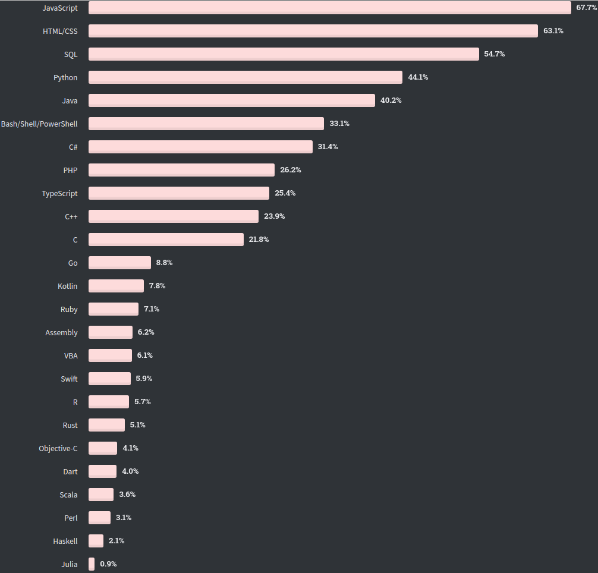
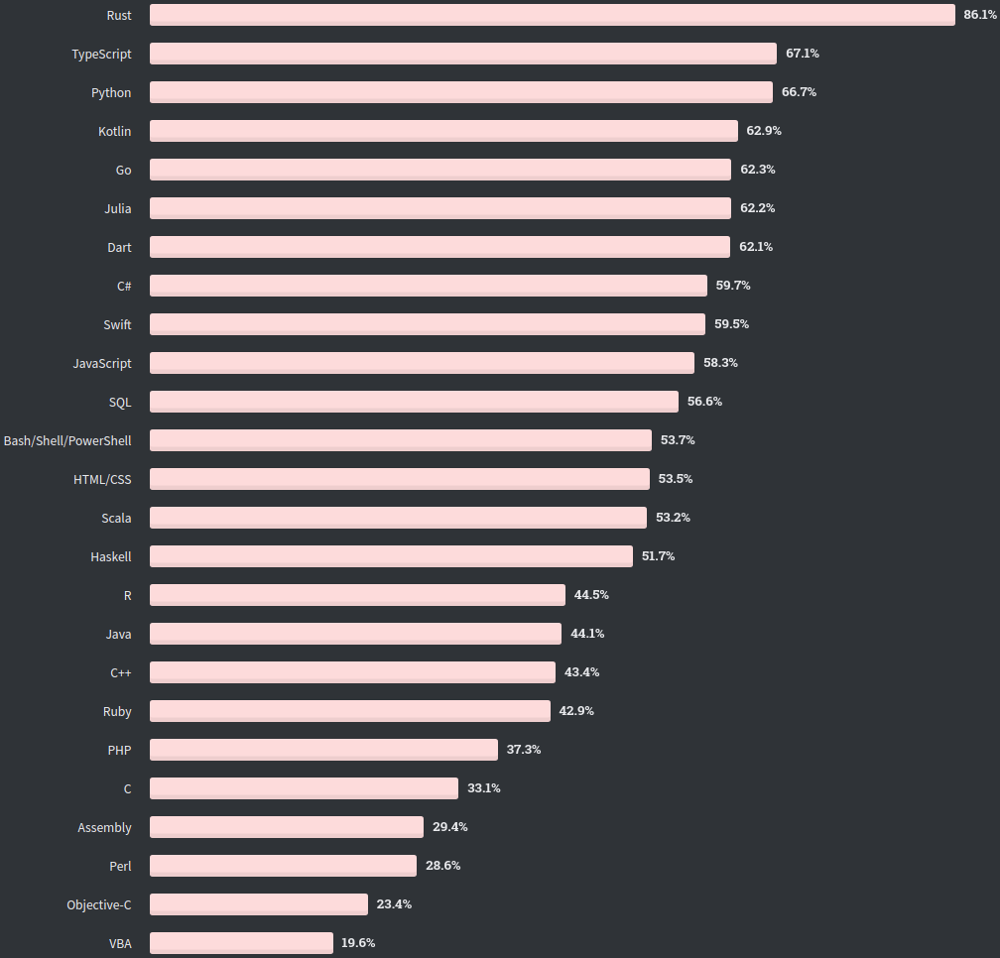
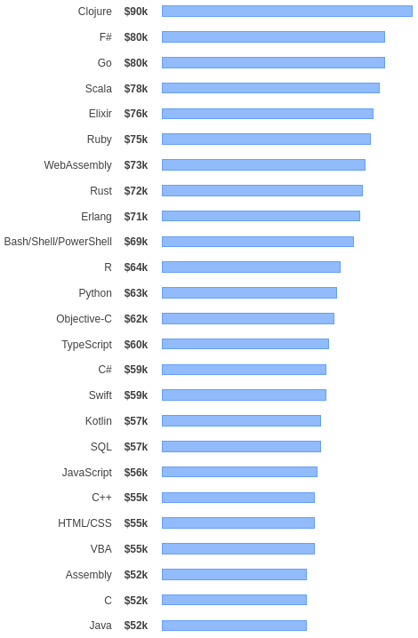
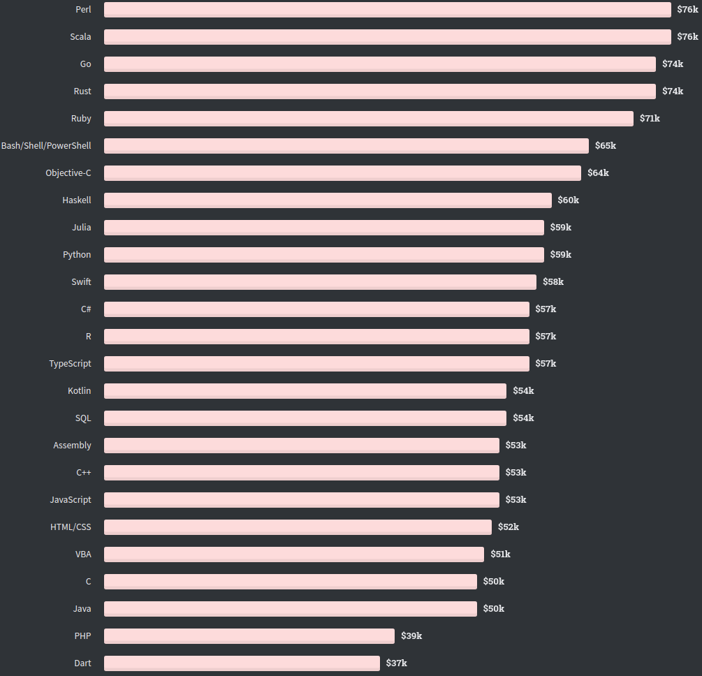

最近几年，随着云计算、区块链等技术的发展，有一门语言逐渐成为大家热衷讨论的对象，成为了继 Python 之后的另一块香饽饽，那就是 Go 语言。

其实如果要追溯历史的话，Go 语言诞生于 Google，从 2007 年便开始设计，并于 2009 年 11 月 10 日正式发布第一版，此后便开始在 Google 内部使用。

正如 Python 借助 AI 的东风大火一样，Go 语言大范围的使用和普及也是借助了云计算、区块链等技术的东风，特别是云计算，以 Google 开源的 Kubernetes 为代表，Go 逐渐成为了云计算领域的第一首选语言，目前还没有竞争对手。

国内最早全面使用 Go 语言的公司要属七牛云了，其创始人许式伟说过一句话：“Go 语言是互联网时代的 C 语言”。可想它如今的地位是不言而喻的。

下图是 2020 StackOverflow 的调查，左边是最流行的语言排行榜，右边是最热门的语言。流行看的是历史地位和应用程度，而热门更多看的是近来的关注程度。

|      最流行的语言       |      最热门的语言       |
| :---------------------: | :---------------------: |
|  |  |

可以看到，Go 语言应用范围具有一定的局限性，所以流行程度并不高，但关注程度是相对较高的，特别是对比前几年的数据你会发现，它是一直增长的。

接下来再来看下大家比较关心的一个问题：哪种语言的薪资较高？毕竟程序员这个行业，回归到现实，都是“面对薪资编程”。如下图所示，左边是 2019 年的数据，右边是 2020 年的数据。

|       2019编程语言薪水排名       |       2020编程语言薪水排名       |
| :------------------------------: | :------------------------------: |
|  |  |

可以看到，Go 语言的薪水排名都稳居前三甲。所以，综合来看，Go 语言是今后最值得学的一门语言。

那 Go 语言到底有哪些优势呢？为何能成为云计算领域的第一大语言？下面简单说说，更多内容在后面的文章中我们会逐一展开。

首先它是一种静态、强一致类型、编译型的系统级编程语言。这几个关键字可能不那么好理解，但是看完下面这幅图相信你能理解个大概：

从类型来看，Go 语言和 Java 语言同处于第一象限，但它编译型、系统级的特性又让它具备 C/C++ 语言的高性能的特性。

其次一个比较重要的优势是 Go 天然支持高并发，小白也能轻松写出高并发代码。

最后值得一提的是 Go 语言的语法简单，学习曲线平坦，开发效率可以和 Python 媲美。

此外，还有很多的优秀特性，后面会带大家逐一领略（大家可以关注下公众号，每天第一时间收到推送，花 5 分钟就可以掌握一个 Go 技能点）。

看到这里大家一定很好奇，有哪些开源项目是使用 Go 语言开发的？

Go 生态系统有众多明星开源软件：Docker、Kubernetes、Rancher、istio、Drone、Lantern、Hyperledger、Caddy、Prometheus、InfluxDB、etcd、CockroachDB、TiDB、Gogs ...

（这里有一份开源的关于 Go 优秀的软件、库和框架：[Awesome Go](https://github.com/avelino/awesome-go)）

极客时间的郝林在他的专栏里也整理过一张使用 Go 语言开发的开源项目大图，非常全。（大家可以看看，原图可以后台回复「go开源」获取，另外，想订阅该专栏可以点击下面的「阅读原文」前往）。

OK，今天就到这里，本文是 5 分钟学 Go 语言的第一篇，先让大家对 Go 有个大概的印象，后面会展开更多的内容，没关注的朋友可以关注下，一起抱团学习。

> 学习 Go 语言，最好的时间是 10 年前，其次是现在。

