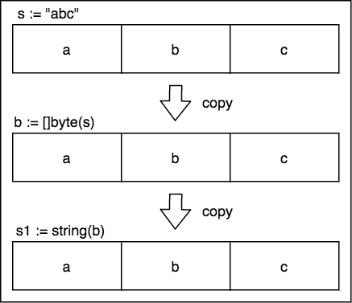

## 字符串是一种特殊的 slice

字符串，即 string 类型，其实是一种特殊的 slice 类型。

它的特殊性体现在两方面，一方面是它的数据结构没有 cap 字段，即不支持求容量的操作，但支持 len 来获取字符串长度，也支持切片 `[i:j]` 操作来获取子串，如下是两者的数据结构对比：

```go
// string
type StringHeader struct {
	Data uintptr
	Len  int
}

// slice
type SliceHeader struct {
	Data uintptr
	Len  int
	Cap  int
}
```

另一方面是它是一种 **只读的切片**  ，也就是它内部的元素是不可变的，这和大多数语言（如 Java、Python）中的特性是一致的。

主要原因是为了性能和安全，性能体现在两个字符串（原字符串和子串）共享同一段底层内存，复制开销低；安全体现在禁止改变共享的底层内存，而且字符串可以作为哈希的键，而哈希的键是不可变的，不然会影响哈希的正常存储。

## 字符串的创建和初始化

字符串虽是特殊的切片，但不支持使用 make 来创建。

使用 var 声明一个 string，默认初始为 string 的零值 `""`。

```go
var str string
```

使用字面量的方式初始化，有两种方式进行初始化，一种是使用双引号：

```go
str := "let's go!"
```

另一种是使用反引号：

```go
str := `hello
world`
```


双引号默认不能换行，双引号内如果再用双引号，需要 `\` 符号来避免编译错误，而反引号则没有这些限制，使用方便：

```go
json := `{
			"name": "let's go", 
		  	"tags": ["golang"]
		 }`
```

> 注意，其中很多的缩进空格也都会保留在最终结果中。


双引号也可以使用转义字符实现换行和缩进等效果，常用的转义字符包括：

- `\n`：换行符
- `\r`：回车符
- `\t`：tab 键
- `\u` 或 `\U`：Unicode 字符
- `\`：反斜杠自身


## 字符串操作

更多更丰富的操作，后面讲 `strings` 这个标准库的时候再细讲，这里先简单讲一些用不到库的操作。

**切片操作：**

```go
str := "hello world"
fmt.Println(len(s)) // 求长度 12
fmt.Println(s[0], s[7]) // 104 119 ('h' 'w')
fmt.Println(:) // "hello, world"
fmt.Println(:5) // "hello"
fmt.Println(7:) // "world"
fmt.Println(5:7) // ", "
fmt.Println(&str[0]) // error, 不能获取元素的地址，原因就是元素不可变，所以依赖操作皆不允许
```

> 注意，s[i] 得到的是第 i 个字节，而不是第 i 个字符，所以，这种方式只对纯 ASCII 码的字符串有效。非 ASCII 字符可能占2个或多个字节，无法获得预想的结果，比如下面的迭代操作。后面分析 UTF-8 编码的时候会详细分析这部分。


**迭代操作：**

使用 `for...range` 进行迭代。

```go
str := "中国"
for index, value := range str {
  fmt.Printf("%#U starts at index is: %d\n", value, index)
}

// 输出
U+4F60 '你' starts at index is: 0 // 一个汉字占 3 个字节
U+597D '好' starts at index is: 3
U+4E2D '中' starts at index is: 6
U+56FD '国' starts at index is: 9
```


**比较操作：**

最简单是通过比较运算符（ `==`、`!=`、 `<`、 `<=`、 `>`、 `>=`）进行比较，比较运算按字节进行，结果符合字典排序。

```go
fmt.Println("go" == "Go") // false, 比较区分大小写
fmt.Println("hello" < "hellow") // true, 比长度
fmt.Println("hello" < "gello")  // false，比字典序
```


**拼接操作：**

使用 `+` 可以拼接两个字符串为一个新的字符串。

```go
s1 := "hello"
s2 := s1
s1 += ", world"
fmt.Println(s1) // "hello world"
fmt.Println(s2) // "hello"
```


更多操作，后面讲 `strings` 库的时候再详述。


## 字符串和整型的相互转换

在有些语言中，可以轻易使用显示类型转换来实现不同类型的转换，比如 Python 中，int 转 string 是 `str(n)`，反之是 `int(s)`。

但是在 Go 语言中，这样是行不通的。

在 Go 语言中这样的转换需要依赖 `strconv` 包来完成，比如：

```go
// 将字符串转换为整型
x, err := strconv.Atoi("123") // x = 123

// 将整型转换成字符串
x := 123
fmt.Println(strconv.Itoa(x)) // "123"
fmt.Printf("%d", x) // "123"
```


可以看到，分别使用两个函数 `Atoi` 和 `Itoa` 来完成转换。对于整型转字符串，还可以使用 `fmt.Printf` 函数，它更好的一点是，还可以转换成不同进制的数字，如：

```go
x := 12
fmt.Printf("%d", x) // 十进制 12
fmt.Printf("%b", x) // 二进制 1100
fmt.Printf("%x", x) // 十六进制 c
fmt.Printf("%o", x) // 八进制 14
```


## 字节切片 []byte 和字符串的相互转换

通过上面的学习，我们已经知道，字符串本身包含的就是一个个的字节元素，所以，字节切片 `[]byte` 和字符串之间可以来回转换。

这种转换带来一个好处就是：字节切片 `[]byte` 是可读写的，而字符串是只读的，可以通过修改字节切片 `[]byte` 元素的值来达到操作字符串元素的目的。因为有的时候不乏需要对字符串的内容进行修改，而且这种转换在解析和序列化 JSON 等数据格式的时候，会频繁使用。

它们之间的转换很简单：

```go
s := "abc"
b := []byte(s)
s1 := string(b)
fmt.Println(b) 	// [97 98 99]
fmt.Println(s1) // "abc"
```

值得注意的是，`[]byte()` 和 `string()` 操作都会对原来的对象产生一份副本，因为要保住字符串内容不被改变。如下：




所以，在数据量较大的场景下，考虑性能，应该尽量避免这种转换。


## 总结

字符串的元素时不可变的

字符串的简单操作

字符串和整型、字节切片之间的互相转换